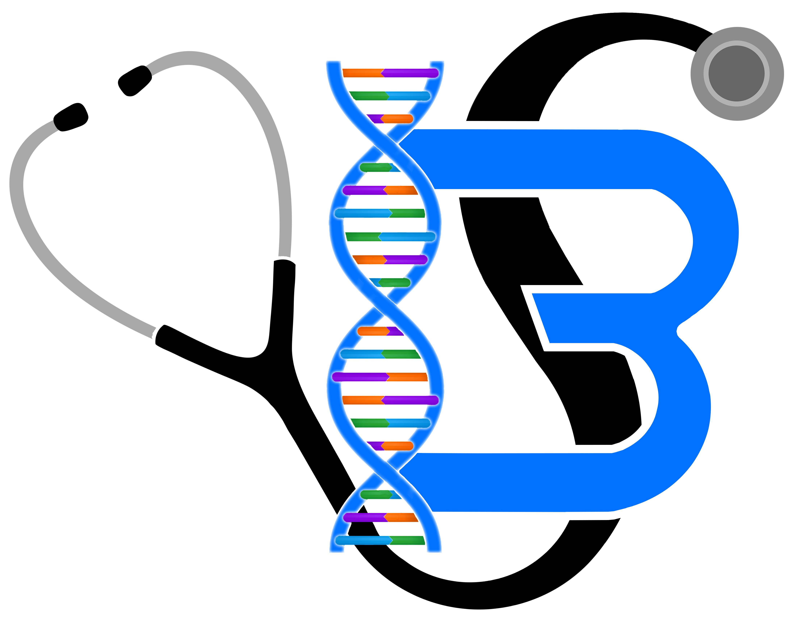

```{r, include=FALSE}
knitr::opts_chunk$set(
  results='asis', 
  echo = FALSE
)

library(glue)
library(tidyverse)
library(fontawesome)

# Set this to true to have links turned into footnotes at the end of the document
PDF_EXPORT <- TRUE

# Holds all the links that were inserted for placement at the end
links <- c()

source('parsing_functions.R')

# Load csv with position info
position_data <- read_csv('positions.csv')
```


```{r}
# When in export mode the little dots are unaligned, so fix that. 
if(PDF_EXPORT){
  cat("
  <style>
  :root{
    --decorator-outer-offset-left: -6.5px;
  }
  </style>")
}
```


Aside
================================================================================

{width=100%}

```{r}
# When in export mode the little dots are unaligned, so fix that. 
if(PDF_EXPORT){
  cat("View this CV online with links at _segal.co.za_")
} else {
  cat("[<i class='fas fa-download'></i> Download a PDF of this CV](https://github.com/BradSegal/cv/raw/master/segal_cv.pdf)")
}
```

Contact {#contacts}
--------------------------------------------------------------------------------

- <i class="fa fa-envelope"></i> [Brad@Segal.co.za](mailto:Brad@Segal.co.za)

- <i class="fa fa-github"></i> [github.com/BradSegal](https://github.com/BradSegal)

- <i class="fa fa-linkedin"></i> [linkedin.com/BradMaxSegal](https://www.linkedin.com/in/bradmaxsegal/)

- <i class="fa fa-phone"></i> [+27 791-737-867](tel:+27791737867)


Skills {#skills}
--------------------------------------------------------------------------------

- `r fa("stethoscope")` Clinical Medicine
- `r fa("search")` Research
- `r fa("robot")` Machine Learning -    PyTorch, SciKit Learn
- `r fa("signal")` Data Analysis
- `r fa("cube")` 3D Printing
- `r fa("chalkboard-teacher")` Teaching / Tutoring
- `r fa("code")` Programming:
  - `r fa("python")` Python 
  - `r fa("r-project")` R 
  - `r fa("java")` Java
  - `r fa("google")` Flutter / Dart
  - `r fa("android")` Android 
  - `r fa("js")` JavaScript / Typescript
  - `r fa("angular")` Angular
  - `r fa("fire")` Firebase


Disclaimer {#disclaimer}
--------------------------------------------------------------------------------
Last updated on `r Sys.Date()`.
Written in R with use of the *Pagedown* package.


Main
================================================================================

Brad Segal {#title}
--------------------------------------------------------------------------------

```{r}
intro_text <- "
I am an aspiring medical student with a passion for technology and development. While studying medicine I have been working on a variety of other projects such as an automated marking and analytics suite for medical exams, a lightweight management software for student-run events and 3D printing a variety of medical models. I am an artificial intelligence enthusiast and aim to work to combine this passion alongside my medical career to develop tools to aid in patient care and streamline diagnostics.
"

cat(sanitize_links(intro_text))
```


Education {data-icon=graduation-cap data-concise=true}
--------------------------------------------------------------------------------

```{r}
print_section(position_data, 'education')
```


Certificates {data-icon=certificate data-concise=true}
--------------------------------------------------------------------------------

```{r}
print_section(position_data, 'certificates')
```


Research Experience {data-icon=laptop}
--------------------------------------------------------------------------------

```{r}
print_section(position_data, 'research_positions')
```


General Experience {data-icon=briefcase}
--------------------------------------------------------------------------------

```{r}
print_section(position_data, 'experience')
```


Publications, Posters, and Talks {data-icon=book}
--------------------------------------------------------------------------------

```{r}
print_section(position_data, 'academic_articles')
```


```{r}
if(PDF_EXPORT){
  cat("
  
Links {data-icon=link}
--------------------------------------------------------------------------------

<br>


")
  
  walk2(links, 1:length(links), function(link, index){
    print(glue('{index}. {link}'))
  })
}
```


